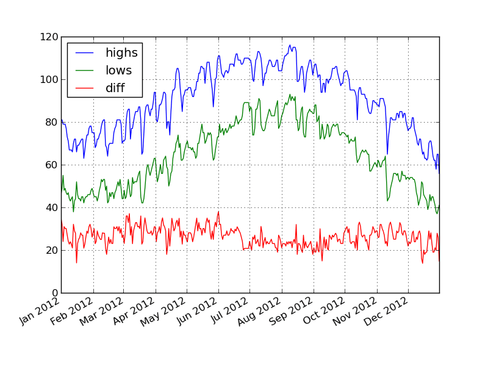

Pandas and Friends
------------------

* Austin Godber
* Mail: godber@uberhip.com
* Twitter: @godber
* Source: http://github.com/desertpy/presentations

.. raw:: pdf

  PageBreak oneColumn

What does it do?
----------------

Pandas is a Python data analysis tool built on top of NumPy that provides a
suite of data structures and data manipulation functions to work on those data
structures.  It is particularly well suited for working with time series data.

Getting Started - Installation
------------------------------

Installing with pip or apt-get::

  pip install pandas
  # or
  sudo apt-get install python-pandas

* Mac - Homebrew or MacPorts to get the dependencies, then pip
* Windows - Python(x,y)?, Commercial Pythons

Panda's Friends!
----------------

* IPython
* Numpy
* Matplotlib

.. image:: panda-on-a-unicorn.jpg

Getting Started - Dependencies
------------------------------

Dependencies, required, recommended and optional

.. code-block:: bash

  # Required
  numpy, python-dateutil, pytx
  # Recommended
  numexpr, bottleneck
  # Optional
  cython, scipy, pytables, matplotlib, statsmodels, openpyxl

Background - IPython
--------------------

IPython is a fancy python console.  Try running ``ipython`` or ``ipython
--pylab`` on your command line.  Some IPython tips

.. code-block:: python

   # Special commands, 'magic functions', begin with %
   %quickref, %who, %run, %reset
   # Shell Commands
   ls, cd, pwd, mkdir
   # Need Help?
   help(), help(obj), obj?, function?
   # Tab completion of variables, attributes and methods

Background - IPython Notebook
-----------------------------

There is a web interface to IPython, known as the IPython notebook, start it
like this

.. code-block:: bash

    ipython notebook
    # or to get all of the pylab components
    ipython notebook --pylab

IPython - Follow Along
----------------------

Follow along by connecting to one of these servers.

* http://ipynb1.desertpy.com
* http://ipynb2.desertpy.com

NOTE: Only active on presentation day.

Background - NumPy
------------------

* NumPy is the foundation for Pandas
* Numerical data structures (mostly Arrays)
* Operations on those.
* Less structure than Pandas provides.

Background - NumPy - Arrays
---------------------------

.. code-block:: python

    import numpy as np
    # np.zeros, np.ones
    data0 = np.zeros((2, 4))
    #array([[ 0.,  0.,  0.,  0.],
    #       [ 0.,  0.,  0.,  0.]])
    data1 = np.arange(100)
    #array([  0, 1, 2, .. 99])

Background - NumPy - Arrays
---------------------------
.. code-block:: python

    data = np.arange(20).reshape(4, 5)
    #array([[ 0,  1,  2,  3,  4],
    #       [ 5,  6,  7,  8,  9],
    #       [10, 11, 12, 13, 14],
    #       [15, 16, 17, 18, 19]])
    data.dtype    #dtype('int64')
    result = data * 20.5
    #array([[ 0. , 20.5, 41. , 61.5, 82. ], ...
    #dtype('float64')

Now, on to Pandas
-----------------

.. image:: panda-giving-another-panda-a-hand.jpg

Pandas
------

* Tabular, Timeseries, Matrix Data - labeled or not
* Sensible handling of missing data and data alignment
* Data selection, slicing and reshaping features
* Robust data import utilities.
* Advanced time series capabilities

Data Structures
----------------

* Series - 1D labeled array
* DataFrame - 2D labeled array
* Panel - 3D labeled array (More D)

Assumed Imports
---------------

In my code samples, assume I import the following

.. code-block:: python

    import pandas as pd
    import numpy as np

See ``code/series_ex1.py`` for python source from which the next slides were
derived.

Series
------

* one-dimensional labeled array
* holds any data type
* axis labels known asi index
* ``dict``-like

Create a Simple Series
----------------------

.. code-block:: python

    s1 = pd.Series([1, 2, 3, 4, 5])
    # 0    1
    # 1    2
    # 2    3
    # 3    4
    # 4    5
    # dtype: int64

Series Operations
-----------------

.. code-block:: python

    print s1 * 5
    # 0     5
    # 1    10
    # 2    15
    # 3    20
    # 4    25
    # dtype: int64

Series Operations - Cont.
-------------------------

.. code-block:: python

    print s1 * 5.0
    # 0     5
    # 1    10
    # 2    15
    # 3    20
    # 4    25
    # dtype: float64

Series Index
------------

.. code-block:: python

    s2 = pd.Series([1, 2, 3, 4, 5],
                    index=['a', 'b', 'c', 'd', 'e'])
    # a    1
    # b    2
    # c    3
    # d    4
    # e    5
    # dtype: int64

Date Convenience Functions
--------------------------

A quick aside ...

.. code-block:: python

    dates = pd.date_range('20130626', periods=5)
    # <class 'pandas.tseries.index.DatetimeIndex'>
    # [2013-06-26 00:00:00, ..., 2013-06-30 00:00:00]
    # Length: 5, Freq: D, Timezone: None

    dates[0]
    # <Timestamp: 2013-06-26 00:00:00>

Datestamps as Index
-------------------

.. code-block:: python

    s3 = pd.Series([1, 2, 3, 4, 5], index=dates)
    # 2013-06-26    1
    # 2013-06-27    2
    # 2013-06-28    3
    # 2013-06-29    4
    # 2013-06-30    5
    # Freq: D, dtype: int64

Selecting By Index
------------------

Note that the integer index is retained along with the new date index.

.. code-block:: python

    s3[0]
    # 1
    s3[1:3]
    # 2013-06-27    2
    # 2013-06-28    3
    # Freq: D, dtype: int64

Selecting by value
------------------

.. code-block:: python

    s3[s3 < 3]
    # 2013-06-26    1
    # 2013-06-27    2
    # Freq: D, dtype: int64

Selecting by Label (Date)
-------------------------

.. code-block:: python

    s3['20130626':'20130628']
    # 2013-06-26    1
    # 2013-06-27    2
    # 2013-06-28    3
    # Freq: D, dtype: int64

Series Wrapup
-------------

Things not covered but you should look into:

* Other instantiation options: ``dict``
* Operator Handling of missing data ``NaN``
* Reforming Data and Indexes
* Boolean Indexing
* Other Series Attributes:

  * ``index`` - ``index.name``
  * ``name`` - Series name

DataFrame
---------

* 2-dimensional labeled data structure
* Like a SQL Table, Spreadsheet or ``dict`` of ``Series`` objects.
* Columns of potentially different types
* Operations, slicing and other behavior just like ``Series``

See ``code/dataframe_ex1.py`` for python source from which the next slides were
derived.

DataFrame - Simple
------------------

.. code-block:: python

   data1 = pd.DataFrame(np.random.rand(4, 4))
   #          0         1         2         3
   # 0  0.748663  0.119829  0.382114  0.375031
   # 1  0.549362  0.409125  0.336181  0.870665
   # 2  0.102960  0.539968  0.356454  0.661136
   # 3  0.233307  0.338176  0.577226  0.966152

DataFrame - Index/Column Names
------------------------------

.. code-block:: python

  dates = pd.date_range('20130626', periods=4)
  data2 = pd.DataFrame(np.random.rand(4, 4),
                       index=dates, columns=list('ABCD'))
  #                    A         B         C         D
  # 2013-06-26  0.538854  0.061999  0.099601  0.010284
  # 2013-06-27  0.800049  0.978754  0.035285  0.383580
  # 2013-06-28  0.761694  0.764043  0.136828  0.066216
  # 2013-06-29  0.129422  0.756846  0.931354  0.380510

DataFrame - Manipulating
------------------------

See? You never need Excel again!

.. code-block:: python

    data2['E'] = data2['B'] + 5 * data2['C']
    #                    A         B         C         D         E
    # 2013-06-26  0.014781  0.929893  0.402966  0.014548  2.944723
    # 2013-06-27  0.968832  0.015926  0.976208  0.507152  4.896967
    # 2013-06-28  0.381733  0.916911  0.828290  0.678275  5.058361
    # 2013-06-29  0.447551  0.066915  0.308007  0.426910  1.606950

DataFrame - Column Access
-------------------------

.. code-block:: python

    # Deleting a Column
    del data2['E']

    # Column Access as a dict
    data2['B']
    # or attribute
    data2.B

DataFrame - Row Access
----------------------

.. code-block:: python

    # by row label
    data2.loc['20130627']
    # by integer location
    data2.iloc[1]

DataFrame - Taking a Peek
-------------------------

.. code-block:: python

   data3 = pd.DataFrame(np.random.rand(400, 4))
   data2.head()
   #          0         1         2         3
   # 0  0.245475  0.488223  0.624225  0.563708
   # 1  0.237461  0.441690  0.162622  0.173519

   data2.tail()
   #          0         1         2         3
   # 398  0.474941  0.847748  0.682227  0.871416
   # 399  0.414240  0.819523  0.234805  0.333394

Panel
-----

Like DataFrame but 3 or more dimensions.

IO Tools
--------

Robust IO tools to read in data from a variety of sources

* `CSV <http://pandas.pydata.org/pandas-docs/stable/io.html#io-read-csv-table>`_
* `Clipboard <http://pandas.pydata.org/pandas-docs/stable/io.html#clipboard>`_
* `SQL <http://pandas.pydata.org/pandas-docs/stable/io.html#sql-queries>`_
* `Excel <http://pandas.pydata.org/pandas-docs/stable/io.html#io-excel>`_
* `HDF <http://pandas.pydata.org/pandas-docs/stable/io.html#hdf5-pytables>`_

Plotting
--------

* `Matplotlib <http://pandas.pydata.org/pandas-docs/stable/visualization.html#plotting-with-matplotlib>`_ - The standard Python plotting tool
* `Trellis <http://pandas.pydata.org/pandas-docs/stable/rplot.html>`_ - An 'R' inspired Matplotlib based plotting tool

Bringing it Together - Data
---------------------------

The csv file (``code/phx-temps.csv``) containing Phoenix weather data from
GSOD::

  1973-01-01 00:00:00,53.1,37.9
  1973-01-02 00:00:00,57.9,37.0
  ...
  2012-12-30 00:00:00,64.9,39.0
  2012-12-31 00:00:00,55.9,41.0

Bringing it Together - Code
---------------------------

.. code-block:: python

    # simple readcsv
    phxtemps1 = pd.read_csv('phx-temps.csv')
    # define index, parse dates, name columns
    phxtemps2 = pd.read_csv('phx-temps.csv', index_col=0,
                            names=['highs', 'lows'],
                            parse_dates=True)

Bringing it Together - Code
---------------------------

.. code-block:: python

    import matplotlib.pyplot as plt

    phxtemps2 = pd.read_csv('phx-temps.csv', index_col=0,
                            names=['highs', 'lows'],
                            parse_dates=True)
    phxtemps2.plot()  # pandas convenience method
    plt.savefig('phxtemps2.png')

Bringing it Together - Plot
---------------------------

.. image:: phxtemps2-all.gif

Bringing it Together - Plot
---------------------------

.. image:: phxtemps2-all.gif

Boo, Pandas and Friends would cry if they saw such a plot.

Bringing it Together - Plot
---------------------------

.. code-block:: python

  phxtemps2['20120101':'20121231'].plot()

.. image:: phxtemps2-2012.gif

Bringing it Together - Plot
---------------------------

.. code-block:: python

    phxtemps2['diff'] = phxtemps2.highs - phxtemps2.lows
    phxtemps2['20120101':'20121231'].plot()

Bringing it Together - Plot
---------------------------

Alternatives
------------

* AstroPy seems to have similar data structures.
* I suspect there are others.

References
----------

* `Pandas Documentation <http://pandas.pydata.org/pandas-docs/stable/index.html>`_
* `Python for Data Analysis <http://www.amazon.com/Python-Data-Analysis-Wes-McKinney/dp/1449319793/>`_
* Presentation Source - https://github.com/desertpy/presentations

.. header::

        Pandas and Friends

.. footer::

        © Austin Godber (@godber), 2013
