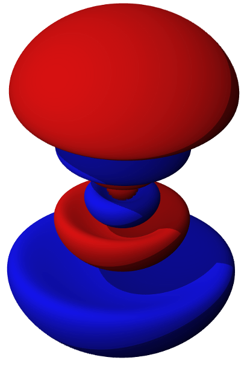

Using Virtualenv
----------------

ATOM - Austin's Thing of the Month
++++++++++++++++++++++++++++++++++
Simplify your python project dependency management.

* Austin Godber
* Mail: godber@uberhip.com
* Twitter: @godber
* Source: http://github.com/godber/ATOM

.. raw:: pdf

  PageBreak oneColumn

What does it do?
----------------

Creates isolated environments for your python dependencies.

* Have you ever had project A need version 0.75 of libX and project B need version 0.82 of the same library?
* Solving mixed dependencies on complex projects gets messy fast.
* Works on windows, though this presentation is Unix-ish.

Getting Started
---------------

Installing with easy_install::

  sudo easy_install virtualenv

Creating environments::

  virtualenv <envname>
  virtualenv project1
  virtualenv --relocatable relocatable-project
  virtualenv --no-site-packages isolated-project

What do you get?
----------------

::

  project1/
  |-- bin
  |-- include
  |   +-- python2.6 -> /usr/include/python2.6
  +-- lib
      +-- python2.6
          |-- config -> /usr/lib/python2.6/config
          |-- distutils
          |-- encodings -> /usr/lib/python2.6/encodings
          |-- lib-dynload -> /usr/lib/python2.6/lib-dynload
          +-- site-packages

What is in bin/?
----------------

A few helper scripts and any package executables go here::

  activate{,.csh,.fish}
  activate_this.py
  easy_install
  pip
  python

On windows it is: ``activate.bat`` and ``deactivate.bat``

How to use it.
--------------
Activate!
::

  source project1/bin/activate

Work!
::

  pip install django #NO SUDO!!!!

Deactivate!
::

  deactivate

Go Orbital with virutalenvwrapper
---------------------------------
Install
::

  sudo easy_install virtualenvwrapper
  # prep your environment
  export WORKON_HOME=~/python-environments
  mkdir -p $WORKON_HOME
  ln -s $WORKON_HOME ~/.virtualenvs
  source /usr/local/bin/virtualenvwrapper.sh

Put the ``source`` line in your shell startup file.

What does this provide?
-----------------------

 * Common environment installation location
 * Tab Completion and Hooks
 * Convenient shortcuts

   * ``mkvirtualenv`` - Creates environment
   * ``workon`` - Activates
   * ``lssitepackages`` - Show packages

References
----------

* `virtualenv <http://virtualenv.openplans.org/>`_
* `virtualenvwrapper <http://www.doughellmann.com/projects/virtualenvwrapper/>`_
* `P5M1 Orbital Image <http://en.wikipedia.org/wiki/File:P5M1.png>`_
* Presentation Source - http://github.com/godber/ATOM

.. header::

        ATOM: Virtualenv

.. footer::

        © Austin Godber (@godber), 2010
